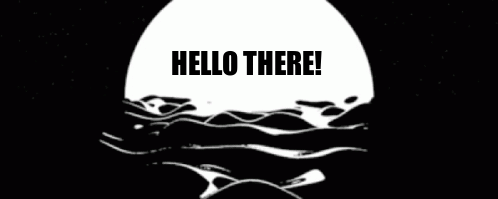

  
  &#8287;&#8287;&#8287;&#8287;&#8287;
  
  &#8287;&#8287;&#8287;&#8287;&#8287;
  
  &#8287;&#8287;&#8287;&#8287;&#8287;
  
  &#8287;&#8287;&#8287;&#8287;&#8287;
  
  &#8287;&#8287;&#8287;&#8287;&#8287;
  

 

  
Hello 👋, I'm Gustavo, an enthusiastic and ambitious back-end developer. Currently, I am an intern at Santander Bank. My current focus is working with back-end development using Java and Spring Boot. I love networking, meeting new people, and having conversations!🤩

  
More about me😁

- 👨‍💻 I started programming around the age of 14, and since then, I haven't stopped.

- 🕴 My LinkedIn profile: https://www.linkedin.com/in/gustavo-leite-183b39236/.

- 💪 I love going to the gym.

- 🎮 I love videogames!

- 🎂 I am addicted to sweets.

- ☕i love coffee.

  

## 🔥 Github Stats

   
   

 📘 My top open source projects

  <a href="https://github.com/GusLeite/gamelist">

  

<!--
**GusLeite/GusLeite** is a ✨ _special_ ✨ repository because its `README.md` (this file) appears on your GitHub profile.

Here are some ideas to get you started:

- 🔭 I’m currently working on ...
- 🌱 I’m currently learning ...
- 👯 I’m looking to collaborate on ...
- 🤔 I’m looking for help with ...
- 💬 Ask me about ...
- 📫 How to reach me: ...
- 😄 Pronouns: ...
- ⚡ Fun fact: ...
-->
